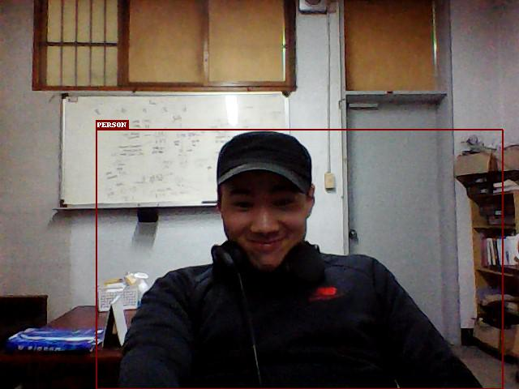

Start in here  

you can taste simple ssd model detection 

### pretrained model 
In this repo,as title show well , i used pretrained model on VOC   
You can download  
[here](https://drive.google.com/file/d/1bvJfF6r_zYl2xZEpYXxgb7jLQHFZ01Qe/view)  

if you want to read more specific training info. then click [this](https://github.com/sgrvinod/a-PyTorch-Tutorial-to-Object-Detection#model-checkpoint)
